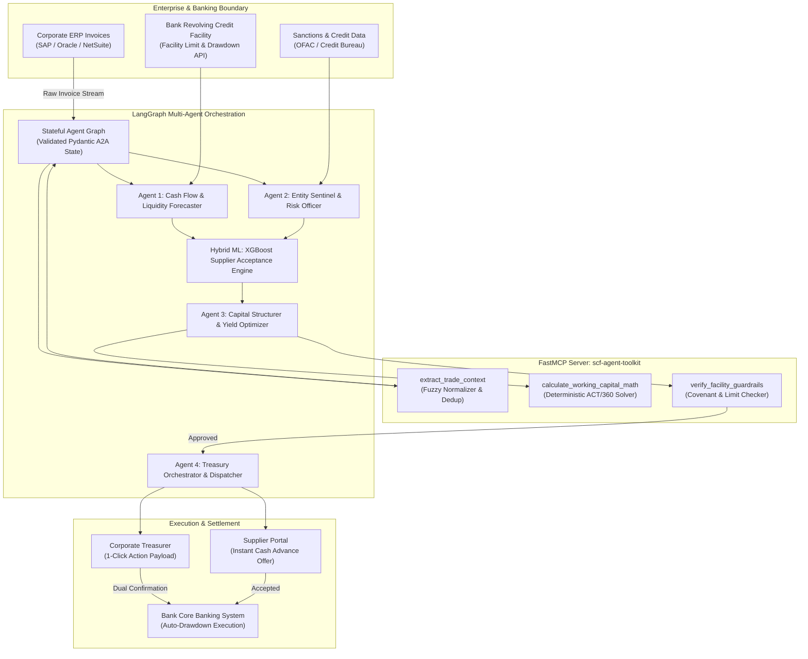

# Autonomous Supply Chain Finance & Working Capital Floating Engine

[](LICENSE)
[](#-monorepo-architecture)
[](#-gcp-deployment-cloud-run-vs-gke)
[](#-automated-cicd-via-gcp-cloud-build)
[-blueviolet.svg)](#-the-reusable-tool-scf-agent-toolkit-fastmcp-server)
[](#-the-reusable-tool-scf-agent-toolkit-fastmcp-server)
[](#-system-architecture--workflow)
[](#-hybrid-tabular-ml--llm-reasoning)
[](#-test-driven-development-tdd-standard)

An autonomous, multi-agent financial intelligence engine and open-source **Model Context Protocol (MCP)** toolkit designed to bridge corporate ERP payables, bank revolving credit facilities, and supplier liquidity demands. 

The project delivers a complete, production-grade enterprise stack structured as a unified monorepo:
1. **`scf-agent-toolkit` (FastMCP Server):** A universal, plug-and-play MCP server providing deterministic ERP trade context normalization (the "URL-to-Markdown" for trade finance), audit-grade working capital math, and bank facility guardrail validators that any agent framework (LangGraph, Claude, Gemini, CrewAI) can consume.
2. **Autonomous Multi-Agent Orchestrator (LangGraph + Hybrid ML):** A stateful agentic system combining an XGBoost supplier acceptance model with LLM treasury reasoning to continuously monitor ERP invoice streams, project 60-day cash flow, resolve supplier entities, dynamically structure Reverse Factoring vs. Dynamic Discounting, and dispatch 1-click execution payloads.
3. **Interactive TypeScript Web App (Next.js / React / Tailwind):** A high-performance treasury cockpit visualizing live ERP invoice streams, interactive 60-day cash curves, real-time agent reasoning event streams (SSE), and 1-click approval actions.
4. **Cloud-Native GCP Deployment:** Automated CI/CD via Google Cloud Build targeting serverless Google Cloud Run.

---

## 📌 Executive Summary & Problem Statement

### The Working Capital Paradox
Corporate banks globally approve hundreds of billions in revolving working capital credit lines and trade finance facilities for investment-grade corporate clients. Yet, **40% to 60% of these approved credit limits sit completely idle and unutilized**.

The fundamental friction is operational:
1. **Manual & Slow Drawdowns:** Drawing down bank credit lines for individual or grouped supplier invoices requires manual treasury reconciliation, manual credit requests, and fragmented communication between ERPs, treasury management systems (TMS), and corporate banking portals.
2. **Corporate Cash Volatility:** Corporate buyers face seasonal liquidity troughs and strict quarterly working capital targets (DPO/DSO optimization), leaving them hesitant to commit balance-sheet cash for early supplier payments.
3. **Supplier Liquidity Starvation:** Tier-2 and mid-sized suppliers operate on tight cash buffers, waiting 60 to 120 days for invoice settlement. When liquidity crunches strike, suppliers are forced into predatory invoice factoring or expensive unsecured short-term loans.
4. **LLM Limitations in Trade Finance:** Basic LLM prompt-chaining fails catastrophically in banking: LLMs hallucinate floating-point financial math, misunderstand day-count conventions (ACT/360 vs. ACT/365), and struggle with messy, unstandardized ERP trade data.
5. **Tripartite Value Destruction:**
   - **Financing Banks** miss out on lucrative, low-risk, short-term trade loan interest and fee income from idle committed facilities.
   - **Corporate Buyers** forgo significant early-payment discount yields (often 12–24% annualized returns) and face supply chain fragility.
   - **Suppliers** struggle with working capital instability and exorbitant cost of capital.

```
       ┌─────────────────────────────────────────────────────────────┐
       │                THE WORKING CAPITAL PARADOX                  │
       └─────────────────────────────────────────────────────────────┘
                                      │
         ┌────────────────────────────┼────────────────────────────┐
         ▼                            ▼                            ▼
  [Financing Banks]          [Corporate Buyers]           [Mid-Tier Suppliers]
  • 40-60% idle credit lines  • Seasonal cash troughs      • 60-120 day payment terms
  • Zero yield on committed   • Missed early discounts     • Starved for early cash
    undrawn capacity          • Manual drawdown processes  • Expensive alternative debt
         │                            │                            │
         └────────────────────────────┼────────────────────────────┘
                                      │
                                      ▼
             [ Autonomous SCF & Capital Floating Engine ]
                 Real-Time Optimization & Execution
```

---

## 💡 The Solution

The **Autonomous Supply Chain Finance & Working Capital Floating Engine** transforms static credit lines and trapped payables into an active, high-velocity liquidity network. Operating as an autonomous multi-agent system connected to corporate ERP invoice streams and bank credit facilities, the system executes an automated 4-stage pipeline whenever a high-value supplier invoice is approved:

1. **60-Day Cash Flow & Idle Capacity Forecasting:**
   Evaluates the corporate buyer's real-time cash position, scheduled disbursements, collections forecast, and unutilized bank credit line headroom over rolling 30/60/90-day horizons.
2. **Entity Resolution, Deduplication & Risk Sentinel:**
   Resolves and deduplicates the supplier entity against internal ERP vendor masters, open trade ledgers, anti-fraud registries, and sanctions/credit watchlists to eliminate duplicate financing risk and supplier impersonation.
3. **Dynamic Capital Structuring & Deal Optimization:**
   Analyzes whether the invoice is best financed via **Dynamic Discounting** (corporate balance-sheet cash) or **Reverse Factoring / Payables Finance** (bank credit line drawdown). Computes exact metrics:
   - Annualized Percentage Rate (APR)
   - Dynamic discount sliding scale (e.g., 2/10 net 60)
   - Bank margin and liquidity spread
   - Net buyer savings vs. supplier cost of capital
4. **Actionable One-Click Execution Dispatch:**
   Packages the optimal financing structure into a cryptographic, actionable one-click payload delivered directly to the Corporate Treasurer and the Supplier portal before liquidity windows close.

---

## 🔌 The Reusable Tool: `scf-agent-toolkit` (FastMCP Server)

Just like tools converting messy HTML to clean Markdown enabled LLMs to read the web, **`scf-agent-toolkit`** (or `fincontext-mcp`) solves the two most dangerous hurdles in financial AI: **unstandardized ERP trade data** and **non-deterministic financial math**.

Built on the **Model Context Protocol (MCP)** using `FastMCP`, this server exposes standardized, audit-grade tools that plug directly into Claude Desktop, Cursor, LangGraph, CrewAI, or any custom agent:

```
                ┌──────────────────────────────────────────────┐
                │        Any AI Agent (LangGraph / Claude)     │
                └──────────────────────┬───────────────────────┘
                                       │ (JSON-RPC / MCP Protocol)
                                       ▼
 ┌───────────────────────────────────────────────────────────────────────────────┐
 │               scf-agent-toolkit (FastMCP Financial Tool Server)               │
 │                                                                               │
 │   ┌────────────────────────┐  ┌───────────────────────┐  ┌──────────────────┐ │
 │   │  Module A: Trade       │  │  Module B: Working    │  │  Module C: Pre-  │ │
 │   │  Ledger Normalizer     │  │  Capital Math Solver  │  │  Flight Guardrail│ │
 │   │  • Fuzzy Golden Record │  │  • ACT/360 & ACT/365  │  │  • Credit Caps   │ │
 │   │  • Payment Term Parser │  │  • Dynamic Discounting│  │  • Concentration │ │
 │   │  • Deduplication Check │  │  • Reverse Factoring  │  │  • AML/Sanctions │ │
 │   └────────────────────────┘  └───────────────────────┘  └──────────────────┘ │
 └───────────────────────────────────────────────────────────────────────────────┘
```

### Module A: Trade Ledger Context Normalizer
- **What it solves:** ERPs (SAP IDoc, Oracle, NetSuite, Tally) output messy, deeply nested JSON or scanned records where vendor names vary ("Reliance Ind." vs "RELIANCE INDUSTRIES LTD"), noise obscures line items, and payment terms are embedded in text strings ("2/10 Net 60").
- **MCP Tool:** `extract_trade_context(raw_invoice: dict, erp_ledger: list) -> CleanTradeContext`
- **Under the hood:** Employs fuzzy string matching (RapidFuzz) and entity deduplication to map counterparties to a canonical Golden Record, checks for duplicate invoice numbers across open ledgers, parses payment terms into structured day offsets, and outputs token-optimized Markdown/JSON for agent reasoning.

### Module B: Deterministic Working Capital Solver
- **What it solves:** LLMs cannot reliably perform floating-point interest calculations, day-count basis math (ACT/360 vs. ACT/365), compounding discount curves, or bank net interest margin (NIM) formulas.
- **MCP Tools:**
  - `calculate_dynamic_discount(invoice_amount, days_accelerated, hurdle_rate, cost_of_funds)`
  - `simulate_reverse_factoring_spread(limit_available, supplier_risk_tier, base_rate, tenor_days)`
- **Under the hood:** Pure deterministic Python routines returning exact, audit-grade financial data: Implied APR, Bank Net Interest Margin, Supplier Haircut, Net Advance, and Buyer Cash-on-Cash Return.

### Module C: Guardrail & Limit Pre-Flight Validator
- **What it solves:** Banks and corporate treasuries require strict, non-negotiable safety guardrails. An autonomous agent must never generate an offer that breaches a credit facility, exceeds single-supplier concentration limits, or violates AML/sanctions policies.
- **MCP Tool:** `verify_facility_guardrails(buyer_id, supplier_id, proposed_amount) -> GuardrailVerdict`
- **Under the hood:** Evaluates hard threshold rules against facility covenants and returns signed boolean clearance before offer structuring proceeds.

---

## 🧠 Hybrid Tabular ML + LLM Reasoning

Traditional AI architectures either rely purely on machine learning (inflexible, black-box) or purely on generative LLMs (hallucinatory math, slow, ungrounded). This engine pairs **Tabular Machine Learning** with **Agentic LLM Reasoning**:

```
                       [ Incoming Approved Invoice ]
                                     │
           ┌─────────────────────────┴─────────────────────────┐
           ▼                                                   ▼
  [ Tabular ML: XGBoost ]                             [ LLM Treasury Agent ]
  • Predicts Supplier Acceptance Probability          • Interprets Treasury Policy Covenants
    at discount rate $d$                              • Contextualizes Seasonal Liquidity Needs
  • Scores Counterparty Risk Profile                  • Generates Transparent Offer Explanations
  • Evaluates Buyer Cash Flow Volatility              • Synthesizes Multi-Stakeholder Payloads
           │                                                   │
           └─────────────────────────┬─────────────────────────┘
                                     │
                                     ▼
                   [ Optimal Win-Win Financing Deal ]
```

1. **XGBoost Classifier / Regressor:** Trained on historical supplier payment acceptance data to predict the elasticity curve: *Given an invoice of \$250,000 accelerated by 35 days, what discount rate maximizes the likelihood of supplier acceptance while exceeding the buyer's hurdle rate?*
2. **Reasoning Agent (LLM):** Evaluates corporate treasury guidelines, liquidity priorities, and strategic vendor relationships, using the XGBoost predictions and MCP math tools to assemble the final proposal.

---

## 🏛️ System Architecture & Workflow



---

## 🤖 Multi-Agent Topology & A2A State Contract

Agents communicate over a stateful LangGraph graph using strictly typed Pydantic models (Agent-to-Agent / A2A Protocol):

| Agent / Component | Responsibility | Core Tools Called | Key Output State |
| :--- | :--- | :--- | :--- |
| **Normalizer & Dedup** | Ingests raw ERP payload, maps vendor to golden record, checks duplicate invoices | `extract_trade_context` (MCP) | `CleanTradeContext` |
| **Cash Forecaster** | Evaluates 60-day buyer cash trajectory and unutilized credit line headroom | ERP Cash Balances, Bank Facility API | `CashForecastState` |
| **Risk Sentinel** | Screens sanctions, runs vendor credit checks, verifies unencumbered title | Sanctions Watchlist, Trade Registry | `SupplierRiskProfile` |
| **Hybrid ML Engine** | Predicts supplier discount acceptance probability curve | XGBoost Acceptance Inference | `AcceptanceCurve` |
| **Capital Structurer** | Determines Dynamic Discounting vs. Reverse Factoring; computes APR and spreads | `calculate_dynamic_discount`, `simulate_reverse_factoring_spread` (MCP) | `FinancingProposal` |
| **Guardrail Sentinel** | Enforces bank facility limits, concentration caps, and regulatory limits | `verify_facility_guardrails` (MCP) | `GuardrailVerdict` |
| **Treasury Dispatcher** | Assembles dual-approval, cryptographically signed 1-click execution payloads | Payload Cryptographic Signer | `ActionablePayload` |

---

## 📊 Core Decision Matrix: Reverse Factoring vs. Dynamic Discounting

The Capital Structuring Agent evaluates the corporate buyer's cost of capital against the bank's facility interest rate and the supplier's required discount rate:

$$\text{Buyer Hurdle Rate} = r_{\text{buyer}}, \quad \text{Bank Facility Rate} = r_{\text{bank}} + \text{Margin}, \quad \text{Supplier Early Payment Discount} = d_{\text{supplier}}$$

```
                                  [Invoice Approved]
                                          │
                         Is Corporate Balance Sheet Cash
                        Plentiful and above Hurdle Margin?
                                    /           \
                                  YES            NO
                                  /               \
            [DYNAMIC DISCOUNTING]                   Is Bank Credit Line
        Buyer uses surplus cash to pay              Available & Cost-Effective?
        supplier early at discount.                           /             \
        • Return: 15-22% annualized APR                     YES              NO
        • Zero bank borrowing cost                          /                 \
                                              [REVERSE FACTORING]         [STANDARD TERMS]
                                         Bank funds invoice early;        Pay on maturity date;
                                         buyer repays bank at maturity.   supplier waits 60-90 days.
                                         • Bank earns margin spread
                                         • Corporate preserves cash
                                         • Supplier gets immediate funds
```

---

## 🏗️ Monorepo Architecture

To maintain absolute type-safety and synchronize schemas across the Python financial backend and TypeScript frontend, the project is structured as a clean monorepo:

```
autonomous-scf-engine/
├── apps/
│   ├── web/                       # TypeScript Frontend (Next.js / Tailwind / Shadcn)
│   │   ├── src/
│   │   │   ├── components/        # Cash Curve, Invoice Stream, Agent Visualizer
│   │   │   ├── hooks/             # SSE streaming hooks for LangGraph agent telemetry
│   │   │   └── types/             # Auto-synced TypeScript schemas from Pydantic
│   │   ├── package.json
│   │   └── Dockerfile.web         # Multi-stage production container
│   └── api/                       # Python FastAPI Backend & Orchestration Gateway
│       ├── main.py                # REST & SSE streaming endpoints
│       └── Dockerfile.api         # Lightweight Python 3.11 container
├── packages/
│   ├── mcp_server/                # scf-agent-toolkit (FastMCP Server)
│   │   ├── server.py              # FastMCP server entry point (stdio / SSE)
│   │   └── modules/
│   │       ├── normalizer.py      # Module A: Trade Ledger Context Normalizer (RapidFuzz)
│   │       ├── math_solver.py     # Module B: Deterministic Working Capital Math (ACT/360)
│   │       └── guardrails.py      # Module C: Pre-Flight Guardrails & Credit Caps
│   └── orchestrator/              # Multi-Agent LangGraph Engine
│       ├── graph.py               # Stateful LangGraph definition
│       ├── state.py               # Strict Pydantic A2A state contract
│       ├── agents/                # Cash Forecaster, Risk Sentinel, Deal Structurer, Dispatcher
│       └── ml/                    # XGBoost Supplier Acceptance Model
├── tests/                         # Rigorous Test-Driven Suite (100% Tested)
│   ├── test_normalizer.py         # Entity matching, term parsing & dedup tests
│   ├── test_math_solver.py        # Exact penny math & day-count tests
│   ├── test_guardrails.py         # Over-limit & sanctions breach tests
│   ├── test_acceptance_ml.py      # ML probability & inference tests
│   └── test_orchestrator.py       # End-to-end multi-agent pipeline tests
├── cloudbuild.yaml                # GCP Cloud Build CI/CD Pipeline
└── pyproject.toml                 # Root workspace dependencies
```

---

## ☁️ GCP Deployment: Cloud Run vs. GKE Decision

| Criteria | Google Cloud Run (Selected) | Google Kubernetes Engine (GKE) |
| :--- | :--- | :--- |
| **Cost & Idle Efficiency** | **Scales to Zero:** \$0 cost when idle. Pay only for actual milliseconds of agent execution. | **Costly:** Minimum 2–3 control plane & worker VM instances running 24/7 (\$150–\$300+/month idle). |
| **Operational Overhead** | **Zero Infra Ops:** Fully serverless container execution. No node pools or cluster upgrades. | **High:** Complex Kubernetes manifests (Deployments, Ingress, HPA, CertManager, RBAC). |
| **Streaming Support** | **Native:** Supports HTTP/2, WebSockets, and Server-Sent Events (SSE) with up to 60-min timeouts. | Supported, but requires custom Ingress controller tuning. |
| **Deployment Speed** | **Instant:** Deploys directly from Cloud Build via `gcloud run deploy` in <30 seconds. | Requires cluster provisioning, manifest applies, and rolling pod rollout. |
| **Recommendation** | **100% Best Choice** for API, LangGraph, FastMCP, and Web UI. | Overkill unless running dedicated self-hosted multi-node GPU clusters (vLLM). |

---

## 🚀 Automated CI/CD via GCP Cloud Build

The `cloudbuild.yaml` pipeline enforces strict quality gates before any code reaches production:

```
[ Git Push / PR ]
       │
       ▼
[ Cloud Build Trigger ]
       │
       ├─► Step 1: Run Python Unit & Math Tests (pytest) ────► [FAILS BUILD IF ANY TEST FAILS]
       ├─► Step 2: Run TypeScript Lint & TypeCheck (tsc) ────► [FAILS BUILD IF TYPES MISMATCH]
       │
       ▼
[ Build Multi-Stage Docker Containers ]
       ├── apps/api (Python FastAPI + LangGraph + FastMCP)
       └── apps/web (Next.js TypeScript UI)
       │
       ▼
[ Push to Google Artifact Registry ]
       │
       ▼
[ Zero-Downtime Deploy to Google Cloud Run ]
       ├── https://scf-api-...run.app
       └── https://scf-web-...run.app
```

---

## 🛡️ Institutional-Grade Engineering Rules

Developing a financial engine of this caliber requires strict adherence to corporate banking standards:

1. **The "Iron Wall" Boundary (Deterministic Math vs. Stochastic Reasoning):**  
   The LLM **never** calculates discount rates, interest compounding, or net payouts. The LLM only interprets policies and reasons over options. All math is performed by deterministic Python MCP tools using exact day-count conventions.
2. **Arbitrage-Grade Precision (`decimal.Decimal`):**  
   Floating-point inaccuracy (`0.1 + 0.2 != 0.3`) is intolerable in banking. Currency and discount spreads are computed with exact decimal precision to prevent penny discrepancies.
3. **Idempotency & Double-Financing Locking:**  
   Every invoice run generates a deterministic idempotency key (`hash(buyer_id, invoice_id, face_value)`). Retried webhooks or duplicate agent triggers can never issue double-drawdowns.
4. **Pre-Flight Guardrails Before Structuring:**  
   No offer payload can ever be dispatched without a signed pass verdict from `verify_facility_guardrails`.
5. **Real-Time Agent Telemetry via SSE:**  
   The TypeScript frontend streams agent thoughts, node transitions, and calculations via Server-Sent Events (SSE), giving treasurers complete visibility into the AI's reasoning.

---

## 🧪 Test-Driven Development (TDD) Standard

**Rule:** Every single backend module, tool, and orchestrator node must have a corresponding test file validating real scenarios before code is considered complete.

- `tests/test_normalizer.py`: Verifies fuzzy matching against 50+ messy vendor variations, checks term parsing (`2/10 Net 60` -> `discount=2.0, days=10, net=60`), and tests duplicate invoice rejection.
- `tests/test_math_solver.py`: Asserts exact ACT/360 and ACT/365 calculations against known financial benchmark tables down to the exact cent.
- `tests/test_guardrails.py`: Simulates facility limit breaches and AML watchlist hits to prove the engine blocks unauthorized proposals.
- `tests/test_acceptance_ml.py`: Tests the XGBoost inference model on edge cases (extreme discount rates, short tenors).
- `tests/test_orchestrator.py`: Runs full end-to-end LangGraph state machine executions with mock ERP invoices.

---

## 📄 License

This project is licensed under the [Apache License 2.0](LICENSE).

