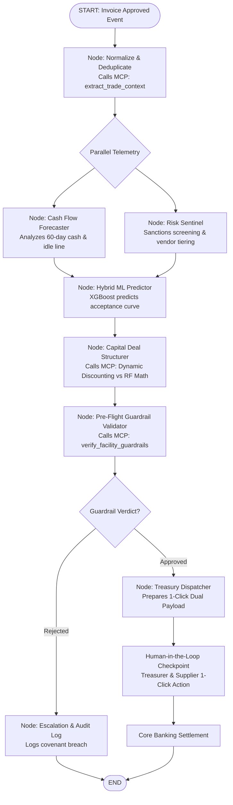

# Detailed Technical Plan: Autonomous Supply Chain Finance & Working Capital Floating Engine

## 1. Executive Blueprint & Objectives

### 1.1 Core Mission
Build an autonomous, multi-agent financial intelligence engine and open-source **Model Context Protocol (MCP)** toolkit that bridges corporate ERP payables, bank revolving credit facilities, and supplier liquidity demands. The engine monitors approved invoice streams in real time, projects cash flow trajectories, resolves supplier identities and risk profiles, dynamically structures optimal financing instruments (Reverse Factoring vs. Dynamic Discounting), and dispatches actionable, one-click execution payloads to corporate treasurers and suppliers.

### 1.2 Target Metrics & Success KPIs
- **Credit Line Utilization:** Elevate corporate revolving credit line drawdowns from the current 40–50% stagnation to 80%+.
- **Origination Velocity:** Reduce end-to-end invoice financing structuring time from 5–7 business days to under 30 seconds.
- **Yield Optimization:** Capture corporate early-payment discount yields (15–22% annualized APR) while safeguarding liquidity above treasury cash floors.
- **Supplier Liquidity Injection:** Provide mid-market and SME suppliers with institutional-rate liquidity 30–90 days ahead of standard payment terms.
- **Deterministic Risk Guarantees:** 100% duplicate-invoice prevention and zero credit facility limit breaches.

---

## 2. System Architecture: The Three-Tier Monorepo

```
┌─────────────────────────────────────────────────────────────────────────────────────────────────┐
│                                    LAYER 1: scf-agent-toolkit                                   │
│                        (The "URL-to-Markdown" for Trade Finance & FastMCP Server)               │
│                                                                                                 │
│  An open-source, universal Model Context Protocol (MCP) server that any agent                   │
│  (Claude, Gemini, LangGraph, CrewAI) can call for:                                              │
│  1. Normalizing messy ERP invoices and mapping to Golden Records (RapidFuzz).                   │
│  2. Deterministic, audit-grade working capital math (ACT/360, APR, Dynamic Discounting, RF).    │
│  3. Bank credit facility guardrail and concentration pre-flight validation.                     │
└───────────────────────────────────────────────┬─────────────────────────────────────────────────┘
                                                │ (FastMCP Tools / Stdio / SSE)
                                                ▼
┌─────────────────────────────────────────────────────────────────────────────────────────────────┐
│                          LAYER 2: AUTONOMOUS MULTI-AGENT ORCHESTRATOR                           │
│                          (LangGraph Stateful A2A Engine + Hybrid ML)                            │
│                                                                                                 │
│  • Strictly typed Agent-to-Agent (A2A) Pydantic state machine.                                  │
│  • Hybrid Tabular ML (XGBoost) predicting supplier discount acceptance curves.                  │
│  • LLM reasoning agents interpreting treasury policy, covenants, and generating 1-click         │
│    dual-action execution payloads.                                                              │
└───────────────────────────────────────────────┬─────────────────────────────────────────────────┘
                                                │ (REST API & Real-Time SSE Streams)
                                                ▼
┌─────────────────────────────────────────────────────────────────────────────────────────────────┐
│                               LAYER 3: TYPESCRIPT TREASURY COCKPIT                              │
│                               (Next.js / Tailwind / Interactive UI)                             │
│                                                                                                 │
│  • Real-time ERP invoice feed with one-click trigger simulations.                               │
│  • Interactive 60-day cash forecasting chart with credit facility headroom overlay.             │
│  • Live Agent Thought & Execution Telemetry Console (SSE streaming).                            │
│  • One-click Dual-Approval Action Cockpit for Corporate Treasurers & Suppliers.                 │
└─────────────────────────────────────────────────────────────────────────────────────────────────┘
```

---

## 3. Monorepo Organization & Codebase Layout

```
autonomous-scf-engine/
├── apps/
│   ├── web/                         # TypeScript Frontend (Next.js 14+ / React / Tailwind)
│   │   ├── src/
│   │   │   ├── app/                 # Next.js App Router (dashboard, invoices, offers)
│   │   │   ├── components/
│   │   │   │   ├── CashFlowChart.tsx      # 60-day interactive cash trajectory chart
│   │   │   │   ├── InvoiceFeed.tsx        # ERP streaming payables table
│   │   │   │   ├── AgentTelemetry.tsx     # Real-time SSE agent reasoning stream
│   │   │   │   └── OneClickCard.tsx       # Treasurer dual-confirmation action card
│   │   │   ├── lib/
│   │   │   │   ├── api-client.ts          # Typed client for backend REST & SSE
│   │   │   │   └── formatters.ts          # Currency and APR formatters
│   │   │   └── types/               # Generated TypeScript interfaces from Pydantic
│   │   ├── package.json
│   │   └── Dockerfile.web           # Production multi-stage Docker build
│   │
│   └── api/                         # FastAPI Gateway & Agent Orchestration Server
│       ├── main.py                  # FastAPI app entry point (REST + SSE endpoints)
│       ├── routes/
│       │   ├── invoices.py          # ERP webhook ingestion & demo triggers
│       │   ├── stream.py            # Server-Sent Events (SSE) telemetry feed
│       │   └── actions.py           # One-click approval / rejection execution
│       ├── dependencies.py          # DB / state manager injection
│       └── Dockerfile.api           # Python 3.11 container with FastMCP & LangGraph
│
├── packages/
│   ├── mcp_server/                  # scf-agent-toolkit (Reusable FastMCP Server)
│   │   ├── server.py                # FastMCP server entry point (stdio & SSE modes)
│   │   └── modules/
│   │       ├── normalizer.py        # Module A: Trade Ledger Context Normalizer
│   │       ├── math_solver.py       # Module B: Deterministic Working Capital Solver
│   │       └── guardrails.py        # Module C: Pre-Flight Guardrails & Limit Validator
│   │
│   └── orchestrator/                # LangGraph Multi-Agent Engine
│       ├── graph.py                 # LangGraph state machine & conditional routers
│       ├── state.py                 # Strict Pydantic A2A state schema (SCFGraphState)
│       ├── agents/
│       │   ├── cash_forecaster.py   # 60-day cash curve & credit facility analyst
│       │   ├── risk_sentinel.py     # Entity resolution & sanctions checker
│       │   ├── capital_structurer.py# Yield optimizer & term sheet builder
│       │   └── treasury_dispatcher.py # 1-click execution payload assembler
│       └── ml/
│           ├── acceptance_model.py  # XGBoost supplier discount acceptance estimator
│           └── dataset_generator.py # Synthetic historical trade dataset generator
│
├── tests/                           # 100% Test-Driven Verification Suite
│   ├── test_normalizer.py           # RapidFuzz Golden Record & term parser tests
│   ├── test_math_solver.py          # ACT/360, ACT/365, APR & penny precision tests
│   ├── test_guardrails.py           # Credit limit breach & sanctions blocking tests
│   ├── test_acceptance_ml.py        # XGBoost inference & probability edge cases
│   ├── test_orchestrator.py         # Full LangGraph state machine execution tests
│   └── test_api_routes.py           # FastAPI REST and SSE streaming tests
│
├── cloudbuild.yaml                  # GCP Cloud Build CI/CD Configuration
├── pyproject.toml                   # Root Python configuration
└── README.md
```

---

## 4. Layer 1: `scf-agent-toolkit` (FastMCP Server Specification)

### 4.1 Module A: Trade Ledger Context Normalizer
- **Purpose:** Ingests unstandardized, nested ERP invoice records (SAP IDocs, Oracle REST, NetSuite, Tally) and produces a clean, deduplicated Golden Record context block.
- **MCP Tool Signature:**
  ```python
  @mcp.tool()
  def extract_trade_context(
      raw_invoice: dict,
      erp_ledger: list[dict]
  ) -> CleanTradeContext:
      ...
  ```
- **Internal Capabilities:**
  1. **Fuzzy Entity Resolution (`RapidFuzz`):** Maps vendor name strings (e.g., `"Reliance Ind."`, `"RELIANCE IND LTD"`, `"Reliance Industries"`) against the ERP vendor master to identify canonical counterparty ID, tax ID (EIN/GSTIN), and credit rating.
  2. **Payment Term Parser:** Parses human-readable and legacy ERP payment terms (e.g., `"2/10 Net 60"`, `"1.5/15 Net 45"`, `"Net 90"`, `"End of Month + 30"`) into structured numerical parameters:
     ```python
     class PaymentTerms(BaseModel):
         discount_percentage: float  # e.g., 2.0
         discount_days: int          # e.g., 10
         net_days: int               # e.g., 60
         raw_term_string: str
     ```
  3. **Duplicate Invoice Sentinel:** Hashes `[vendor_canonical_id, invoice_number, total_amount, currency]` and validates against active trade ledgers to detect duplicate submissions or double-pledged receivables.
  4. **Token-Optimized Output:** Generates a structured JSON object and a concise markdown context block engineered specifically for LLM prompt context windows without noise.

---

### 4.2 Module B: Deterministic Working Capital Solver
- **Purpose:** Provides bank-grade financial calculators using exact day-count conventions and compounding mathematics.

#### Tool B.1: `calculate_dynamic_discount`
```python
@mcp.tool()
def calculate_dynamic_discount(
    invoice_amount: float,
    days_accelerated: int,
    total_tenor_days: int,
    buyer_hurdle_rate_apr: float,
    baseline_discount_pct: float = 2.0,
    day_count_convention: str = "ACT/365"
) -> DynamicDiscountResult:
    ...
```
- **Financial Math Logic:**
  - Let $F = \text{invoice\_amount}$, $D_{\text{acc}} = \text{days\_accelerated}$, $N = \text{total\_tenor\_days}$.
  - Basis $B = 360 \text{ or } 365$.
  - Dynamic Sliding Scale Discount Rate:
    $$d = \text{baseline\_discount\_pct} \times \left( \frac{D_{\text{acc}}}{N} \right)$$
  - Absolute Discount Amount:
    $$\Delta = F \times \left( \frac{d}{100} \right)$$
  - Net Supplier Advance:
    $$\text{Payout} = F - \Delta$$
  - Effective Annualized Percentage Rate (APR) earned by Buyer:
    $$\text{APR}_{\text{buyer}} = \left( \frac{\Delta}{\text{Payout}} \right) \times \left( \frac{B}{D_{\text{acc}}} \right)$$
  - Buyer Hurdle Check: Validates if $\text{APR}_{\text{buyer}} \ge \text{buyer\_hurdle\_rate\_apr}$.

#### Tool B.2: `simulate_reverse_factoring_spread`
```python
@mcp.tool()
def simulate_reverse_factoring_spread(
    invoice_amount: float,
    days_accelerated: int,
    base_benchmark_rate: float,         # e.g. SOFR 5.3%
    bank_margin_spread: float,          # e.g. 1.8%
    platform_fee_pct: float = 0.2,       # e.g. 0.20%
    buyer_rebate_share_pct: float = 0.3   # 30% of margin shared with corporate buyer
) -> ReverseFactoringResult:
    ...
```
- **Financial Math Logic:**
  - All-in Financing Rate:
    $$r_{\text{all-in}} = \text{base\_benchmark\_rate} + \text{bank\_margin\_spread} + \text{platform\_fee\_pct}$$
  - Supplier Cost of Financing:
    $$C_{\text{supplier}} = F \times r_{\text{all-in}} \times \left( \frac{D_{\text{acc}}}{360} \right)$$
  - Net Supplier Payout:
    $$\text{Payout} = F - C_{\text{supplier}}$$
  - Bank Gross Interest Income:
    $$\text{Bank Revenue} = F \times (\text{base\_benchmark\_rate} + \text{bank\_margin\_spread}) \times \left( \frac{D_{\text{acc}}}{360} \right)$$
  - Corporate Buyer Rebate (Working Capital Yield):
    $$\text{Buyer Rebate} = F \times (\text{bank\_margin\_spread} \times \text{buyer\_rebate\_share\_pct}) \times \left( \frac{D_{\text{acc}}}{360} \right)$$

---

### 4.3 Module C: Guardrail & Limit Pre-Flight Validator
- **Purpose:** Deterministic pre-flight clearance ensuring no offer breaches bank credit facilities, corporate covenants, or AML/sanctions rules.
- **MCP Tool Signature:**
  ```python
  @mcp.tool()
  def verify_facility_guardrails(
      buyer_id: str,
      supplier_canonical_id: str,
      proposed_amount: float,
      facility_limit: float,
      facility_drawn: float,
      single_supplier_concentration_cap_pct: float = 15.0,
      existing_supplier_exposure: float = 0.0
  ) -> GuardrailVerdict:
      ...
  ```
- **Validation Rules:**
  1. **Facility Capacity:** $\text{facility\_drawn} + \text{proposed\_amount} \le \text{facility\_limit}$.
  2. **Concentration Limit:** $(\text{existing\_supplier\_exposure} + \text{proposed\_amount}) \le \text{facility\_limit} \times (\text{single\_supplier\_concentration\_cap\_pct} / 100)$.
  3. **Risk Tier & Watchlist:** Supplier not present on OFAC, PEP, or internal default registries.
  4. **Output:** Cryptographically verifiable boolean pass/fail with exact breach reasoning if rejected.

---

## 5. Layer 2: Multi-Agent Orchestrator (LangGraph + Hybrid ML)

### 5.1 Hybrid Tabular ML + LLM Reasoning
- **Tabular ML Model (XGBoost):**
  - **Task:** Predict probability of supplier accepting an early payment offer:
    $$P(\text{Acceptance}) = f(D_{\text{acc}}, d_{\text{offered}}, \text{Supplier Risk Tier}, \text{Supplier Cash Trough Score}, \text{Historical Acceptance Ratio})$$
  - **Advantage:** Outperforms LLMs in price elasticity estimation, avoids arbitrary discounting, and converges on the optimal win-win discount spread.
- **Reasoning LLM (Claude / Gemini via LangGraph):**
  - **Task:** Interprets corporate treasury policy constraints (e.g. quarterly DPO targets, upcoming dividend payouts, liquidity reserves).
  - Selects whether to execute Dynamic Discounting (self-funded) or Reverse Factoring (credit-line-funded).
  - Synthesizes clear, auditable explanations for the Corporate Treasurer and an attractive value proposition for the Supplier.

---

### 5.2 Agent-to-Agent (A2A) Strict State Machine
All inter-agent communication in LangGraph is governed by strict Pydantic v2 schemas:

```python
class SCFGraphState(BaseModel):
    # Raw Ingestion
    raw_invoice_id: str
    raw_invoice_payload: dict
    
    # Normalized Trade Context (Output of Module A)
    trade_context: Optional[CleanTradeContext] = None
    
    # Cash Flow & Credit Telemetry
    cash_forecast: Optional[CashForecastTelemetry] = None
    facility_status: Optional[CreditFacilityStatus] = None
    
    # Supplier Intelligence & ML Prediction
    supplier_risk_tier: Optional[str] = None
    ml_acceptance_curve: Optional[dict] = None
    
    # Financing Structuring (Output of Module B)
    recommended_instrument: Optional[str] = None # DYNAMIC_DISCOUNTING | REVERSE_FACTORING
    financial_quote: Optional[FinancingQuote] = None
    
    # Pre-Flight Validation (Output of Module C)
    guardrail_verdict: Optional[GuardrailVerdict] = None
    
    # Execution & Human-in-the-Loop
    actionable_payload: Optional[ActionablePayload] = None
    treasurer_decision: Optional[str] = None # PENDING | APPROVED | REJECTED
    execution_status: str = "INITIALIZED"
    audit_log: list[dict] = []
```

---

### 5.3 LangGraph State Graph Topology



---

## 6. Layer 3: Interactive TypeScript Treasury Cockpit

The frontend is a TypeScript Next.js 14 application styled with Tailwind CSS and accessible components, structured into 4 primary views:

1. **ERP Ingestion Stream & Simulator (`InvoiceFeed.tsx`):**
   - Live stream of synthetic ERP payables events (simulating SAP / Oracle invoice approvals).
   - Allows triggering test invoices with varying payment terms (`"2/10 Net 60"`, `"Net 90"`) and vendor name aliases.
2. **Interactive 60-Day Cash Trajectory (`CashFlowChart.tsx`):**
   - Recharts visualizer charting baseline corporate cash balance, projected inflows/outflows, treasury minimum cash floor, and credit facility undrawn headroom.
   - Shows dynamic simulation of cash curve before vs. after invoice financing.
3. **Live Multi-Agent Reasoning Console (`AgentTelemetry.tsx`):**
   - Connects to `/api/stream/agent-events/{id}` via Server-Sent Events (SSE).
   - Renders animated state progression for each agent node (Normalizer -> Forecaster -> ML Predictor -> Structurer -> Guardrails).
4. **Actionable 1-Click Financing Card (`OneClickCard.tsx`):**
   - Shows the generated term sheet with clear APR, Net Advance, Bank NIM, and Buyer Yield.
   - Provides dual action buttons: **Authorize Credit Draw** (Treasurer) and **Accept Early Payment** (Supplier).

---

## 7. Infrastructure: Cloud Run vs. GKE Decision

### 7.1 Why Cloud Run is Selected
1. **Cost Efficiency & Scale-to-Zero:**
   - **Cloud Run:** Automatically scales to zero when no transactions are processing. You pay exclusively for actual CPU/RAM milliseconds consumed during invoice processing.
   - **GKE:** Requires at least 2–3 compute VM instances running continuously 24/7 plus cluster management fees (~$150–$300+/month idle).
2. **Native Streaming & Extended Timeouts:**
   - Multi-agent orchestration requires 5–15 seconds to execute end-to-end. Cloud Run natively supports HTTP/2, WebSockets, and Server-Sent Events (SSE) with configurable timeouts up to 60 minutes.
3. **Operational Simplicity:**
   - Deploying requires a single CLI command (`gcloud run deploy`) directly from Cloud Build. No complex Kubernetes YAML manifests (`Deployment`, `Service`, `Ingress`, `HPA`, `CertManager`) to configure or maintain.
4. **GKE Threshold:**
   - GKE is only warranted if running self-hosted, multi-node GPU clusters (e.g. running private 70B parameter LLMs on vLLM/Triton). Since LLM reasoning uses Vertex AI / Gemini APIs and XGBoost runs in milliseconds on standard CPU, Cloud Run is the optimal enterprise choice.

---

### 7.2 Automated CI/CD via GCP Cloud Build (`cloudbuild.yaml`)

```yaml
steps:
  # 1. Run Python Unit & Math Tests (Strict Quality Gate)
  - name: 'python:3.11-slim'
    id: 'test-backend'
    entrypoint: 'bash'
    args:
      - '-c'
      - |
        pip install poetry && poetry install
        poetry run pytest tests/ -v --cov=packages

  # 2. Run TypeScript Type-Check & Build
  - name: 'node:20-slim'
    id: 'build-frontend'
    dir: 'apps/web'
    entrypoint: 'bash'
    args:
      - '-c'
      - |
        npm ci
        npm run build

  # 3. Build & Push API Container to Artifact Registry
  - name: 'gcr.io/cloud-builders/docker'
    id: 'docker-api'
    args:
      - 'build'
      - '-t'
      - '$_REGION-docker.pkg.dev/$PROJECT_ID/scf-repo/scf-api:$COMMIT_SHA'
      - '-f'
      - 'apps/api/Dockerfile.api'
      - '.'

  # 4. Build & Push Web Container to Artifact Registry
  - name: 'gcr.io/cloud-builders/docker'
    id: 'docker-web'
    args:
      - 'build'
      - '-t'
      - '$_REGION-docker.pkg.dev/$PROJECT_ID/scf-repo/scf-web:$COMMIT_SHA'
      - '-f'
      - 'apps/web/Dockerfile.web'
      - '.'

  # 5. Deploy API to Cloud Run
  - name: 'gcr.io/google.com/cloudsdktool/cloud-sdk'
    id: 'deploy-api'
    entrypoint: 'gcloud'
    args:
      - 'run'
      - 'deploy'
      - 'scf-api'
      - '--image=$_REGION-docker.pkg.dev/$PROJECT_ID/scf-repo/scf-api:$COMMIT_SHA'
      - '--region=$_REGION'
      - '--platform=managed'
      - '--allow-unauthenticated'
      - '--set-env-vars=ENVIRONMENT=production'

  # 6. Deploy Web to Cloud Run
  - name: 'gcr.io/google.com/cloudsdktool/cloud-sdk'
    id: 'deploy-web'
    entrypoint: 'gcloud'
    args:
      - 'run'
      - 'deploy'
      - 'scf-web'
      - '--image=$_REGION-docker.pkg.dev/$PROJECT_ID/scf-repo/scf-web:$COMMIT_SHA'
      - '--region=$_REGION'
      - '--platform=managed'
      - '--allow-unauthenticated'

substitutions:
  _REGION: 'us-central1'
```

---

## 8. Institutional-Grade Engineering Rules

1. **The "Iron Wall" (Deterministic Math vs. Stochastic Reasoning):**  
   The LLM **must never calculate money**. LLMs are probabilistic text predictors and will hallucinate floating-point math or round off pennies incorrectly. The LLM only interprets policies and reasons over options. All math is calculated by deterministic Python MCP tools using exact day-count conventions.
2. **Arbitrage-Grade Precision (`decimal.Decimal` over `float`):**  
   Standard IEEE 754 floating-point math (`0.1 + 0.2 = 0.30000000000000004`) causes reconciliation drift. For corporate credit lines in the tens of millions, currency amounts must be handled using `decimal.Decimal` (or rounded integer cents).
3. **Idempotency & Double-Financing Locking:**  
   Every invoice processing run generates an idempotency key:
   $$\text{IdempotencyKey} = \text{SHA256}(\text{buyer\_id} + \text{supplier\_canonical\_id} + \text{invoice\_number} + \text{amount})$$
   Network retries or re-fired webhooks must never trigger duplicate draws against the bank credit facility.
4. **Streaming Telemetry (Preventing the "Frozen Spinner" UX):**  
   A multi-agent system takes 5–15 seconds to run through normalization, forecasting, ML scoring, math, and synthesis. If the TypeScript UI simply displays a blank loading spinner, the app feels unresponsive. We stream real-time agent steps and thoughts to the UI via Server-Sent Events (SSE).
5. **GCP Secret Manager & Workload Identity:**  
   Never hardcode API keys or service account JSON files. On Cloud Run, IAM Workload Identity securely authenticates against Vertex AI and Google Cloud Secret Manager.

---

## 9. Test-Driven Development (TDD) Matrix

Every piece of functionality is written alongside a dedicated, concrete test suite. No code is merged without passing tests:

| Module | Test File | Test Cases & Assertions |
| :--- | :--- | :--- |
| **Normalizer** | `tests/test_normalizer.py` | • Fuzzy match `"Reliance Ind."`, `"RELIANCE IND LTD"` -> Canonical ID.<br>• Parse `"2/10 Net 60"` -> `discount=2.0, days=10, net=60`.<br>• Parse `"Net 90"`, `"1.5/15 Net 45"`.<br>• Detect duplicate invoice hash in active ledger. |
| **Math Solver** | `tests/test_math_solver.py` | • Dynamic discount calculation matching hand-calculated financial tables.<br>• ACT/360 vs ACT/365 day-count convention comparison.<br>• Reverse factoring spread: bank NIM, supplier net advance, buyer rebate.<br>• Zero tenor and negative days error handling. |
| **Guardrails** | `tests/test_guardrails.py` | • Pass when facility limit has sufficient undrawn headroom.<br>• Fail with specific reason when proposed amount exceeds limit.<br>• Fail when single-supplier concentration exceeds 15% threshold.<br>• Block transactions involving entities on OFAC/sanctions watchlist. |
| **XGBoost ML** | `tests/test_acceptance_ml.py` | • Verify acceptance probability is monotonically decreasing with higher discount rates.<br>• Assert inference latency < 15ms.<br>• Handle unseen categorical risk tiers gracefully. |
| **LangGraph Graph** | `tests/test_orchestrator.py` | • End-to-end execution from raw invoice to dispatched payload.<br>• Routing to Dynamic Discounting when buyer cash is abundant.<br>• Routing to Reverse Factoring when buyer cash is constrained.<br>• Gating and halt on guardrail rejection. |
| **FastAPI Gateway** | `tests/test_api_routes.py` | • Webhook invoice ingestion response validation.<br>• SSE event streaming endpoint connectivity and event serialization.<br>• One-click action approval and rejection state transitions. |

---

## 10. Phased Execution Roadmap

```
  Phase 1: Foundation, MCP Server & Unit Tests (TDD)
  ├── Setup monorepo structure: apps/api, apps/web, packages/mcp_server, packages/orchestrator
  ├── Implement packages/mcp_server/modules/normalizer.py + tests/test_normalizer.py
  ├── Implement packages/mcp_server/modules/math_solver.py + tests/test_math_solver.py
  ├── Implement packages/mcp_server/modules/guardrails.py + tests/test_guardrails.py
  └── Expose FastMCP server (server.py) with stdio & SSE transports
         │
         ▼
  Phase 2: Hybrid ML Module & Synthetic Dataset
  ├── Build synthetic historical trade dataset generator (dataset_generator.py)
  ├── Train XGBoost acceptance model (acceptance_model.py)
  └── Write tests/test_acceptance_ml.py
         │
         ▼
  Phase 3: Multi-Agent Orchestrator (LangGraph)
  ├── Define strict Pydantic A2A state schema (state.py)
  ├── Implement agent nodes (Cash Forecaster, Risk Sentinel, Deal Structurer, Dispatcher)
  ├── Build LangGraph state machine with conditional routing and pre-flight gates
  └── Write tests/test_orchestrator.py
         │
         ▼
  Phase 4: FastAPI Gateway & TypeScript Web UI
  ├── Build apps/api with REST endpoints and SSE streaming (/api/stream)
  ├── Build apps/web Next.js UI:
  │   ├── Invoice Feed & Simulation Trigger
  │   ├── 60-Day Cash Flow & Headroom Chart
  │   ├── Live Agent Reasoning Telemetry Console (SSE)
  │   └── One-Click Dual-Approval Cockpit Card
  └── Write tests/test_api_routes.py
         │
         ▼
  Phase 5: GCP Cloud Build & Cloud Run Deployment
  ├── Create Dockerfile.api & Dockerfile.web
  ├── Write cloudbuild.yaml multi-step CI/CD pipeline
  └── Verify zero-downtime deployment on Google Cloud Run
```
