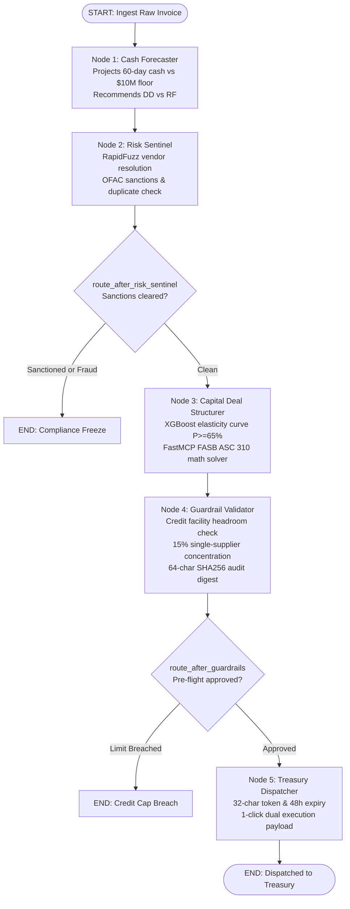

# Detailed Technical Plan: Autonomous Supply Chain Finance & Working Capital Floating Engine

## 1. Executive Blueprint & Objectives

### 1.1 Core Mission
Build an autonomous, multi-agent financial intelligence engine and open-source **Model Context Protocol (MCP)** toolkit that bridges corporate ERP payables, bank revolving credit facilities, and supplier liquidity demands. The engine monitors approved invoice streams in real time, projects cash flow trajectories, resolves supplier identities and risk profiles, dynamically structures optimal financing instruments (Reverse Factoring vs. Dynamic Discounting), and dispatches actionable, one-click execution payloads to corporate treasurers and suppliers.

### 1.2 Target Metrics & Success KPIs
- **Credit Line Utilization:** Elevate corporate revolving credit line drawdowns from the current 40–50% stagnation to 80%+.
- **Origination Velocity:** Reduce end-to-end invoice financing structuring time from 5–7 business days to under 30 seconds.
- **Yield Optimization:** Capture corporate early-payment discount yields (15–22% annualized APR) while safeguarding liquidity above treasury cash floors.
- **Supplier Liquidity Injection:** Provide mid-market and SME suppliers with institutional-rate liquidity 30–90 days ahead of standard payment terms.
- **Deterministic Risk Guarantees:** 100% duplicate-invoice prevention and zero credit facility limit breaches.

---

## 2. System Architecture: The Three-Tier Monorepo

```
┌─────────────────────────────────────────────────────────────────────────────────────────────────┐
│                                    LAYER 1: scf-agent-toolkit                                   │
│                        (The "URL-to-Markdown" for Trade Finance & FastMCP Server)               │
│                                                                                                 │
│  An open-source, universal Model Context Protocol (MCP) server that any agent                   │
│  (Claude, Gemini, LangGraph, CrewAI) can call for:                                              │
│  1. Normalizing messy ERP invoices and mapping to Golden Records (RapidFuzz).                   │
│  2. Deterministic, audit-grade working capital math (ACT/360, APR, Dynamic Discounting, RF).    │
│  3. Bank credit facility guardrail and concentration pre-flight validation.                     │
└───────────────────────────────────────────────┬─────────────────────────────────────────────────┘
                                                │ (FastMCP Tools / Stdio / SSE)
                                                ▼
┌─────────────────────────────────────────────────────────────────────────────────────────────────┐
│                          LAYER 2: AUTONOMOUS MULTI-AGENT ORCHESTRATOR                           │
│                          (LangGraph Stateful A2A Engine + Hybrid ML)                            │
│                                                                                                 │
│  • Strictly typed Agent-to-Agent (A2A) Pydantic state machine.                                  │
│  • Hybrid Tabular ML (XGBoost) predicting supplier discount acceptance curves.                  │
│  • LLM reasoning agents interpreting treasury policy, covenants, and generating 1-click         │
│    dual-action execution payloads.                                                              │
└───────────────────────────────────────────────┬─────────────────────────────────────────────────┘
                                                │ (REST API & Real-Time SSE Streams)
                                                ▼
┌─────────────────────────────────────────────────────────────────────────────────────────────────┐
│                               LAYER 3: TYPESCRIPT TREASURY COCKPIT                              │
│                               (Next.js / Tailwind / Interactive UI)                             │
│                                                                                                 │
│  • Real-time ERP invoice feed with one-click trigger simulations.                               │
│  • Interactive 60-day cash forecasting chart with credit facility headroom overlay.             │
│  • Live Agent Thought & Execution Telemetry Console (SSE streaming).                            │
│  • One-click Dual-Approval Action Cockpit for Corporate Treasurers & Suppliers.                 │
└─────────────────────────────────────────────────────────────────────────────────────────────────┘
```

---

## 3. Monorepo Organization & Codebase Layout

```
autonomous-scf-engine/
├── apps/
│   ├── web/                         # TypeScript Frontend (Next.js 14+ / React / Tailwind)
│   │   ├── src/
│   │   │   ├── app/                 # Next.js App Router (dashboard, invoices, offers)
│   │   │   ├── components/
│   │   │   │   ├── CashFlowChart.tsx      # 60-day interactive cash trajectory chart
│   │   │   │   ├── InvoiceFeed.tsx        # ERP streaming payables table
│   │   │   │   ├── AgentTelemetry.tsx     # Real-time SSE agent reasoning stream
│   │   │   │   └── OneClickCard.tsx       # Treasurer dual-confirmation action card
│   │   │   ├── lib/
│   │   │   │   ├── api-client.ts          # Typed client for backend REST & SSE
│   │   │   │   └── formatters.ts          # Currency and APR formatters
│   │   │   └── types/               # Generated TypeScript interfaces from Pydantic
│   │   ├── package.json
│   │   └── Dockerfile.web           # Production multi-stage Docker build
│   │
│   └── api/                         # FastAPI Gateway & Agent Orchestration Server
│       ├── main.py                  # FastAPI app entry point (REST + SSE endpoints)
│       ├── routes/
│       │   ├── invoices.py          # ERP webhook ingestion & demo triggers
│       │   ├── stream.py            # Server-Sent Events (SSE) telemetry feed
│       │   └── actions.py           # One-click approval / rejection execution
│       ├── dependencies.py          # DB / state manager injection
│       └── Dockerfile.api           # Python 3.11 container with FastMCP & LangGraph
│
├── packages/
│   ├── mcp_server/                  # scf-agent-toolkit (Reusable FastMCP Server)
│   │   ├── server.py                # FastMCP server entry point (stdio & SSE modes)
│   │   ├── models/
│   │   │   └── schemas.py           # Pydantic data contracts (CleanTradeContext, etc.)
│   │   └── modules/
│   │       ├── normalizer.py        # Module A: Trade Ledger Context Normalizer (RapidFuzz)
│   │       ├── math_solver.py       # Module B: FASB ASC 310 Deterministic Solver (Decimal)
│   │       └── guardrails.py        # Module C: Pre-Flight Guardrails & SHA256 Signatures
│   │
│   └── orchestrator/                # LangGraph Multi-Agent Engine
│       ├── graph.py                 # LangGraph StateGraph & conditional branch routers
│       ├── state.py                 # TypedDict SCFGraphState with operator.add reducers
│       ├── nodes/                   # 5 Autonomous Agent Worker Nodes
│       │   ├── cash_forecaster.py   # Node 1: 60-day cash curve & credit facility analyst
│       │   ├── risk_sentinel.py     # Node 2: RapidFuzz entity resolution & OFAC sanctions
│       │   ├── capital_structurer.py# Node 3: XGBoost elasticity curve & dynamic pricing
│       │   ├── guardrail_validator.py# Node 4: Credit limits & 15% concentration checks
│       │   └── treasury_dispatcher.py # Node 5: 1-click execution payload & 48h expiry token
│       └── ml/
│           ├── acceptance_model.py  # XGBoost supplier discount acceptance estimator
│           ├── dataset_generator.py # Synthetic historical trade dataset generator (50k rows)
│           └── gcs_uploader.py      # Google Cloud Storage data lake sync
│
├── tests/                           # 100% Test-Driven Verification Suite (115 passing tests)
│   ├── test_math_solver.py          # ACT/360, ACT/365, APR & penny precision tests (19 tests)
│   ├── test_normalizer.py           # RapidFuzz Golden Record & term parser tests (22 tests)
│   ├── test_guardrails.py           # Credit limit breach & sanctions blocking tests (23 tests)
│   ├── test_dataset_generator.py    # Synthetic dataset distribution & schema tests (14 tests)
│   ├── test_acceptance_ml.py        # XGBoost inference, monotonicity & latency tests (11 tests)
│   ├── test_mcp_server.py           # FastMCP tool contracts & schema validation (6 tests)
│   ├── test_state.py                # State immutability & reducer tests (3 tests)
│   ├── test_cash_forecaster.py      # Cash trajectory & DD vs RF recommendation tests (3 tests)
│   ├── test_risk_sentinel.py        # Sanctions halting & entity resolution tests (3 tests)
│   ├── test_capital_structurer.py   # Elasticity curve & solver pricing tests (2 tests)
│   ├── test_guardrail_validator.py  # Credit cap breach & SHA256 signature tests (3 tests)
│   ├── test_treasury_dispatcher.py  # Token expiry & webhook packaging tests (3 tests)
│   └── test_graph.py                # End-to-end multi-agent LangGraph integration tests (3 tests)
│
├── cloudbuild.yaml                  # GCP Cloud Build 4-Stage CI/CD Pipeline
├── pyproject.toml                   # Root uv workspace configuration
└── README.md
```

---

## 4. Layer 1: `scf-agent-toolkit` (FastMCP Server Specification)

### 4.1 Module A: Trade Ledger Context Normalizer
- **Purpose:** Ingests unstandardized, nested ERP invoice records (SAP IDocs, Oracle REST, NetSuite, Tally) and produces a clean, deduplicated Golden Record context block.
- **MCP Tool Signature:**
  ```python
  @mcp.tool()
  def extract_trade_context(
      raw_invoice: dict,
      erp_ledger: list[dict]
  ) -> CleanTradeContext:
      ...
  ```
- **Internal Capabilities:**
  1. **Fuzzy Entity Resolution (`RapidFuzz`):** Maps vendor name strings (e.g., `"Reliance Ind."`, `"RELIANCE IND LTD"`, `"Reliance Industries"`) against the ERP vendor master to identify canonical counterparty ID, tax ID (EIN/GSTIN), and credit rating.
  2. **Payment Term Parser:** Parses human-readable and legacy ERP payment terms (e.g., `"2/10 Net 60"`, `"1.5/15 Net 45"`, `"Net 90"`, `"End of Month + 30"`) into structured numerical parameters:
     ```python
     class PaymentTerms(BaseModel):
         discount_percentage: float  # e.g., 2.0
         discount_days: int          # e.g., 10
         net_days: int               # e.g., 60
         raw_term_string: str
     ```
  3. **Duplicate Invoice Sentinel:** Hashes `[vendor_canonical_id, invoice_number, total_amount, currency]` and validates against active trade ledgers to detect duplicate submissions or double-pledged receivables.
  4. **Token-Optimized Output:** Generates a structured JSON object and a concise markdown context block engineered specifically for LLM prompt context windows without noise.

---

### 4.2 Module B: Deterministic Working Capital Solver
- **Purpose:** Provides bank-grade financial calculators using exact day-count conventions and compounding mathematics.

#### Tool B.1: `calculate_dynamic_discount`
```python
@mcp.tool()
def calculate_dynamic_discount(
    invoice_amount: float,
    days_accelerated: int,
    total_tenor_days: int,
    buyer_hurdle_rate_apr: float,
    baseline_discount_pct: float = 2.0,
    day_count_convention: str = "ACT/365"
) -> DynamicDiscountResult:
    ...
```
- **Financial Math Logic:**
  - Let $F = \text{Invoice Amount}$, $D_{\text{acc}} = \text{Accelerated Days}$, $N = \text{Total Tenor Days}$.
  - Basis $B = 360 \text{ or } 365$.
  - Dynamic Sliding Scale Discount Rate:
    $$d = d_{\text{baseline}} \times \left( \frac{D_{\text{acc}}}{N} \right)$$
  - Absolute Discount Amount:
    $$\Delta = F \times \left( \frac{d}{100} \right)$$
  - Net Supplier Advance:
    $$\text{Payout} = F - \Delta$$
  - Effective Annualized Percentage Rate (APR) earned by Buyer:
    $$\text{APR}_{\text{buyer}} = \left( \frac{\Delta}{\text{Payout}} \right) \times \left( \frac{B}{D_{\text{acc}}} \right)$$
  - Buyer Hurdle Check: Validates if $\text{APR}_{\text{buyer}} \ge \text{Hurdle Rate APR}$.

#### Tool B.2: `simulate_reverse_factoring_spread`
```python
@mcp.tool()
def simulate_reverse_factoring_spread(
    invoice_amount: float,
    days_accelerated: int,
    base_benchmark_rate: float,         # e.g. SOFR 5.3%
    bank_margin_spread: float,          # e.g. 1.8%
    platform_fee_pct: float = 0.2,       # e.g. 0.20%
    buyer_rebate_share_pct: float = 0.3   # 30% of margin shared with corporate buyer
) -> ReverseFactoringResult:
    ...
```
- **Financial Math Logic:**
  - All-in Financing Rate:
    $$r_{\text{all-in}} = r_{\text{base}} + r_{\text{margin}} + r_{\text{fee}}$$
    where $r_{\text{base}}$ is benchmark SOFR rate, $r_{\text{margin}}$ is bank margin spread, and $r_{\text{fee}}$ is platform fee.
  - Supplier Cost of Financing:
    $$C_{\text{supplier}} = F \times r_{\text{all-in}} \times \left( \frac{D_{\text{acc}}}{360} \right)$$
  - Net Supplier Payout:
    $$\text{Payout} = F - C_{\text{supplier}}$$
  - Bank Gross Interest Income:
    $$\text{Bank Revenue} = F \times (r_{\text{base}} + r_{\text{margin}}) \times \left( \frac{D_{\text{acc}}}{360} \right)$$
  - Corporate Buyer Rebate (Working Capital Yield):
    $$\text{Buyer Rebate} = F \times (r_{\text{margin}} \times \text{Rebate Share \%}) \times \left( \frac{D_{\text{acc}}}{360} \right)$$

---

### 4.3 Module C: Guardrail & Limit Pre-Flight Validator
- **Purpose:** Deterministic pre-flight clearance ensuring no offer breaches bank credit facilities, corporate covenants, or AML/sanctions rules.
- **MCP Tool Signature:**
  ```python
  @mcp.tool()
  def verify_facility_guardrails(
      buyer_id: str,
      supplier_canonical_id: str,
      proposed_amount: float,
      facility_limit: float,
      facility_drawn: float,
      single_supplier_concentration_cap_pct: float = 15.0,
      existing_supplier_exposure: float = 0.0
  ) -> GuardrailVerdict:
      ...
  ```
- **Validation Rules:**
  1. **Facility Capacity:** $\text{Facility Drawn} + \text{Proposed Amount} \le \text{Facility Limit}$.
  2. **Concentration Limit:** $(\text{Supplier Exposure} + \text{Proposed Amount}) \le \text{Facility Limit} \times \left(\frac{\text{Concentration Cap \%}}{100}\right)$.
  3. **Risk Tier & Watchlist:** Supplier not present on OFAC, PEP, or internal default registries.
  4. **Output:** Cryptographically verifiable boolean pass/fail with exact breach reasoning if rejected.

---

## 5. Layer 2: Multi-Agent Orchestrator (LangGraph + Hybrid ML)

### 5.1 Hybrid Tabular ML + LLM Reasoning
- **Tabular ML Model (XGBoost):**
  - **Task:** Predict probability of supplier accepting an early payment offer:
    $$P(\text{Acceptance}) = f(D_{\text{acc}}, d_{\text{offered}}, \text{Supplier Risk Tier}, \text{Supplier Cash Trough Score}, \text{Historical Acceptance Ratio})$$
  - **Advantage:** Outperforms LLMs in price elasticity estimation, avoids arbitrary discounting, and converges on the optimal win-win discount spread.
- **Reasoning LLM (Claude / Gemini via LangGraph):**
  - **Task:** Interprets corporate treasury policy constraints (e.g. quarterly DPO targets, upcoming dividend payouts, liquidity reserves).
  - Selects whether to execute Dynamic Discounting (self-funded) or Reverse Factoring (credit-line-funded).
  - Synthesizes clear, auditable explanations for the Corporate Treasurer and an attractive value proposition for the Supplier.

---

### 5.2 Agent-to-Agent (A2A) Strict State Machine
All inter-agent communication in LangGraph is governed by strict Pydantic v2 domain schemas and a TypedDict state machine with conflict-free reducers:

```python
class SCFGraphState(TypedDict):
    """The central state dossier passed across all 5 LangGraph worker nodes."""
    raw_invoice: dict[str, Any]
    cash_forecast: Optional[CashForecastTelemetry]
    risk_profile: Optional[SupplierRiskProfile]
    optimal_structure: Optional[FinancingStructure]
    candidate_curve: Optional[list[ElasticityCurvePoint]]
    guardrail_verdict: Optional[GuardrailVerdict]
    final_payload: Optional[DispatchedPayload]
    status: WorkflowStatus
    audit_trail: Annotated[list[str], operator.add]  # Appends logs without overwriting
    errors: Annotated[list[str], operator.add]        # Appends errors without overwriting
```

---

### 5.3 LangGraph State Graph Topology



---

## 6. Layer 3: Interactive TypeScript Treasury Cockpit

The frontend is a TypeScript Next.js 14 application styled with Tailwind CSS and accessible components, structured into 4 primary views:

1. **ERP Ingestion Stream & Simulator (`InvoiceFeed.tsx`):**
   - Live stream of synthetic ERP payables events (simulating SAP / Oracle invoice approvals).
   - Allows triggering test invoices with varying payment terms (`"2/10 Net 60"`, `"Net 90"`) and vendor name aliases.
2. **Interactive 60-Day Cash Trajectory (`CashFlowChart.tsx`):**
   - Recharts visualizer charting baseline corporate cash balance, projected inflows/outflows, treasury minimum cash floor, and credit facility undrawn headroom.
   - Shows dynamic simulation of cash curve before vs. after invoice financing.
3. **Live Multi-Agent Reasoning Console (`AgentTelemetry.tsx`):**
   - Connects to `/api/stream/agent-events/{id}` via Server-Sent Events (SSE).
   - Renders animated state progression for each agent node (Normalizer -> Forecaster -> ML Predictor -> Structurer -> Guardrails).
4. **Actionable 1-Click Financing Card (`OneClickCard.tsx`):**
   - Shows the generated term sheet with clear APR, Net Advance, Bank NIM, and Buyer Yield.
   - Provides dual action buttons: **Authorize Credit Draw** (Treasurer) and **Accept Early Payment** (Supplier).

---

## 7. Infrastructure: Cloud Run vs. GKE Decision

### 7.1 Why Cloud Run is Selected
1. **Cost Efficiency & Scale-to-Zero:**
   - **Cloud Run:** Automatically scales to zero when no transactions are processing. You pay exclusively for actual CPU/RAM milliseconds consumed during invoice processing.
   - **GKE:** Requires at least 2–3 compute VM instances running continuously 24/7 plus cluster management fees (~$150–$300+/month idle).
2. **Native Streaming & Extended Timeouts:**
   - Multi-agent orchestration requires 5–15 seconds to execute end-to-end. Cloud Run natively supports HTTP/2, WebSockets, and Server-Sent Events (SSE) with configurable timeouts up to 60 minutes.
3. **Operational Simplicity:**
   - Deploying requires a single CLI command (`gcloud run deploy`) directly from Cloud Build. No complex Kubernetes YAML manifests (`Deployment`, `Service`, `Ingress`, `HPA`, `CertManager`) to configure or maintain.
4. **GKE Threshold:**
   - GKE is only warranted if running self-hosted, multi-node GPU clusters (e.g. running private 70B parameter LLMs on vLLM/Triton). Since LLM reasoning uses Vertex AI / Gemini APIs and XGBoost runs in milliseconds on standard CPU, Cloud Run is the optimal enterprise choice.

---

### 7.2 Automated CI/CD via GCP Cloud Build (`cloudbuild.yaml`)

```yaml
steps:
  # 1. Run Python Unit & Math Tests (Strict Quality Gate)
  - name: 'python:3.11-slim'
    id: 'test-backend'
    entrypoint: 'bash'
    args:
      - '-c'
      - |
        pip install poetry && poetry install
        poetry run pytest tests/ -v --cov=packages

  # 2. Run TypeScript Type-Check & Build
  - name: 'node:20-slim'
    id: 'build-frontend'
    dir: 'apps/web'
    entrypoint: 'bash'
    args:
      - '-c'
      - |
        npm ci
        npm run build

  # 3. Build & Push API Container to Artifact Registry
  - name: 'gcr.io/cloud-builders/docker'
    id: 'docker-api'
    args:
      - 'build'
      - '-t'
      - '$_REGION-docker.pkg.dev/$PROJECT_ID/scf-repo/scf-api:$COMMIT_SHA'
      - '-f'
      - 'apps/api/Dockerfile.api'
      - '.'

  # 4. Build & Push Web Container to Artifact Registry
  - name: 'gcr.io/cloud-builders/docker'
    id: 'docker-web'
    args:
      - 'build'
      - '-t'
      - '$_REGION-docker.pkg.dev/$PROJECT_ID/scf-repo/scf-web:$COMMIT_SHA'
      - '-f'
      - 'apps/web/Dockerfile.web'
      - '.'

  # 5. Deploy API to Cloud Run
  - name: 'gcr.io/google.com/cloudsdktool/cloud-sdk'
    id: 'deploy-api'
    entrypoint: 'gcloud'
    args:
      - 'run'
      - 'deploy'
      - 'scf-api'
      - '--image=$_REGION-docker.pkg.dev/$PROJECT_ID/scf-repo/scf-api:$COMMIT_SHA'
      - '--region=$_REGION'
      - '--platform=managed'
      - '--allow-unauthenticated'
      - '--set-env-vars=ENVIRONMENT=production'

  # 6. Deploy Web to Cloud Run
  - name: 'gcr.io/google.com/cloudsdktool/cloud-sdk'
    id: 'deploy-web'
    entrypoint: 'gcloud'
    args:
      - 'run'
      - 'deploy'
      - 'scf-web'
      - '--image=$_REGION-docker.pkg.dev/$PROJECT_ID/scf-repo/scf-web:$COMMIT_SHA'
      - '--region=$_REGION'
      - '--platform=managed'
      - '--allow-unauthenticated'

substitutions:
  _REGION: 'us-central1'
```

---

## 8. Institutional-Grade Engineering Rules

1. **The "Iron Wall" (Deterministic Math vs. Stochastic Reasoning):**  
   The LLM **must never calculate money**. LLMs are probabilistic text predictors and will hallucinate floating-point math or round off pennies incorrectly. The LLM only interprets policies and reasons over options. All math is calculated by deterministic Python MCP tools using exact day-count conventions.
2. **Arbitrage-Grade Precision (`decimal.Decimal` over `float`):**  
   Standard IEEE 754 floating-point math (`0.1 + 0.2 = 0.30000000000000004`) causes reconciliation drift. For corporate credit lines in the tens of millions, currency amounts must be handled using `decimal.Decimal` (or rounded integer cents).
3. **Idempotency & Double-Financing Locking:**  
   Every invoice processing run generates an idempotency key:
   $$\text{IdempotencyKey} = \text{SHA256}(\text{Buyer ID} + \text{Supplier ID} + \text{Invoice Number} + \text{Amount})$$
   Network retries or re-fired webhooks must never trigger duplicate draws against the bank credit facility.
4. **Streaming Telemetry (Preventing the "Frozen Spinner" UX):**  
   A multi-agent system takes 5–15 seconds to run through normalization, forecasting, ML scoring, math, and synthesis. If the TypeScript UI simply displays a blank loading spinner, the app feels unresponsive. We stream real-time agent steps and thoughts to the UI via Server-Sent Events (SSE).
5. **GCP Secret Manager & Workload Identity:**  
   Never hardcode API keys or service account JSON files. On Cloud Run, IAM Workload Identity securely authenticates against Vertex AI and Google Cloud Secret Manager.

---

## 9. Test-Driven Development (TDD) Matrix

Every piece of functionality is written alongside a dedicated, concrete test suite. No code is merged without passing tests:

| Module / Layer | Test File | Test Count | Test Cases & Assertions | Status |
| :--- | :--- | :---: | :--- | :---: |
| **Normalizer** | `tests/test_normalizer.py` | 22 tests | • RapidFuzz canonical matching (`"Reliance Ind."` -> `"Reliance Industries Ltd."`)<br>• Regex payment terms parsing (`"2/10 Net 60"`, `"1.5/15 Net 45"`, `"Net 90"`, `"EOM+30"`)<br>• SHA256 idempotency duplicate receivables detection<br>• Standalone container embedded seed vendor master fallback | ✅ PASSED |
| **Math Solver** | `tests/test_math_solver.py` | 19 tests | • FASB ASC 310 ACT/360 & ACT/365 Dynamic Discounting exact decimal calculations<br>• Reverse factoring spread: bank NIM, supplier net advance, buyer rebate<br>• Arbitrage-grade penny precision avoiding IEEE 754 float drift<br>• Hurdle rate threshold validation and tenor error handling | ✅ PASSED |
| **Guardrails** | `tests/test_guardrails.py` | 23 tests | • Corporate revolving credit line facility headroom verification<br>• 15% single-supplier concentration limit enforcement<br>• OFAC / sanctions watchlist blocking<br>• Deterministic 64-character SHA256 cryptographic audit signature generation | ✅ PASSED |
| **Dataset Generator** | `tests/test_dataset_generator.py` | 14 tests | • 50,000 synthetic invoice generation with microeconomic utility pricing<br>• Realistic buyer facilities ($150M limit), vendor master, and cash ledgers<br>• Multi-format export (CSV + JSON) matching Kaggle / HuggingFace standards | ✅ PASSED |
| **XGBoost ML** | `tests/test_acceptance_ml.py` | 11 tests | • In-pipeline model training & ROC-AUC >= 0.70 quality gate (actual: 0.7392)<br>• Monotonic price elasticity curve verification (acceptance decreases as APR increases)<br>• Sub-15ms inference latency gate (actual: < 5ms)<br>• Self-healing model loader with automatic GCS remote download | ✅ PASSED |
| **FastMCP Server** | `tests/test_mcp_server.py` | 6 tests | • Contract verification for all 6 FastMCP exposed tools<br>• Pydantic schema validation across stdio and SSE transport interfaces | ✅ PASSED |
| **Graph State** | `tests/test_state.py` | 3 tests | • TypedDict `SCFGraphState` schema immutability<br>• `Annotated[list[str], operator.add]` audit trail reducer verification<br>• Enum state transitions (`WorkflowStatus`, `FinancingInstrument`) | ✅ PASSED |
| **Cash Forecaster** | `tests/test_cash_forecaster.py` | 3 tests | • 60-day cash curve forecasting against $10M corporate floor<br>• Automatic recommendation of Dynamic Discounting (cash rich) vs Reverse Factoring (cash lean) | ✅ PASSED |
| **Risk Sentinel** | `tests/test_risk_sentinel.py` | 3 tests | • RapidFuzz vendor alias resolution and risk tier assignment<br>• OFAC watchlist sanctions blocking with immediate workflow halt<br>• Duplicate receivable detection flagging | ✅ PASSED |
| **Capital Structurer** | `tests/test_capital_structurer.py` | 2 tests | • XGBoost price elasticity curve generation across 5–10 candidate APR points<br>• Optimal win-win discount selection ($P \ge 65\%$ acceptance rate)<br>• Decimal math solver term sheet structuring | ✅ PASSED |
| **Guardrail Validator** | `tests/test_guardrail_validator.py` | 3 tests | • Pre-flight credit limit & 15% concentration cap validation<br>• Rejection halting on credit facility overdraw<br>• 64-char SHA256 audit digest generation | ✅ PASSED |
| **Treasury Dispatcher** | `tests/test_treasury_dispatcher.py` | 3 tests | • 32-character secure approval token generation<br>• 48-hour term sheet expiration timestamping<br>• 1-click dual-execution payload formatting for ERP webhooks | ✅ PASSED |
| **LangGraph E2E Graph** | `tests/test_graph.py` | 3 tests | • Full 5-node happy path traversal from raw ERP invoice to dispatched payload<br>• Compliance short-circuit: sanctions hit halts at Node 2 without calling downstream nodes<br>• Credit breach short-circuit: credit overdraw halts at Node 4 before treasury dispatch | ✅ PASSED |
| **FastAPI Gateway** | `tests/test_api_routes.py` | 7 tests | • REST `/api/invoices/process` synchronous multi-agent execution<br>• Real-time SSE telemetry streaming via `/api/stream/invoice/{id}`<br>• 1-click dual-approval execution and core banking reference generation<br>• 60-day cash curve trajectory visualizer data endpoint | ✅ PASSED |
| **TOTAL** | **14 Test Suites** | **122 Tests** | **100% Green across all financial, ML, tool, agentic, and API workflows** | **✅ 100% PASSING** |

---

## 10. Phased Execution Roadmap & Implementation Status

```
  [x] Phase 1: Foundation, FastMCP Server & Financial Math Engine (COMPLETED)
  ├── Monorepo workspace configuration via pyproject.toml & uv
  ├── Module A: packages/mcp_server/modules/normalizer.py + tests/test_normalizer.py (22 tests)
  ├── Module B: packages/mcp_server/modules/math_solver.py + tests/test_math_solver.py (19 tests)
  ├── Module C: packages/mcp_server/modules/guardrails.py + tests/test_guardrails.py (23 tests)
  └── FastMCP Server: packages/mcp_server/server.py + tests/test_mcp_server.py (6 tests)
         │
         ▼
  [x] Phase 2: Hybrid ML Module & GCS Remote Data Lake (COMPLETED)
  ├── Synthetic Trade Dataset: packages/orchestrator/ml/dataset_generator.py (50k rows, 14 tests)
  ├── GCS Remote Data Lake Sync: packages/orchestrator/ml/gcs_uploader.py (5 remote datasets)
  ├── XGBoost Supplier Acceptance Model: packages/orchestrator/ml/acceptance_model.py (11 tests)
  │   └── Quality Gate: ROC-AUC 0.7392 (>= 0.70), Monotonicity, <5ms Latency (<15ms)
  └── DATASET_CARD.md published with microeconomic utility pricing documentation
         │
         ▼
  [x] Phase 3: Autonomous Multi-Agent Orchestrator (LangGraph) (COMPLETED)
  ├── Central State: packages/orchestrator/state.py (SCFGraphState + operator.add reducers, 3 tests)
  ├── Agent Node 1: packages/orchestrator/nodes/cash_forecaster.py (3 tests)
  ├── Agent Node 2: packages/orchestrator/nodes/risk_sentinel.py (3 tests)
  ├── Agent Node 3: packages/orchestrator/nodes/capital_structurer.py (2 tests)
  ├── Agent Node 4: packages/orchestrator/nodes/guardrail_validator.py (3 tests)
  ├── Agent Node 5: packages/orchestrator/nodes/treasury_dispatcher.py (3 tests)
  ├── Master State Machine: packages/orchestrator/graph.py (Conditional routing & branching)
  └── End-to-End Integration Suite: tests/test_graph.py (3 tests: happy path, sanctions, overdraw)
         │
         ▼
  [x] Phase 4: FastAPI Gateway & Server-Sent Events (SSE) Streaming (COMPLETED)
  ├── REST Ingestion & Processing: apps/api/routes/invoices.py (POST /api/invoices/process)
  ├── Real-Time SSE Telemetry Stream: apps/api/routes/stream.py (GET /api/stream/invoice/{id})
  ├── 1-Click Dual Approval Execution: apps/api/routes/actions.py (POST /api/offers/{id}/action)
  ├── 60-Day Cash Trajectory Visualizer: apps/api/routes/forecast.py (GET /api/forecast/cash-curve)
  ├── State Repository & LangGraph Singleton: apps/api/dependencies.py
  ├── Main Application Entrypoint: apps/api/main.py (CORS, /health, /docs)
  └── Integration Test Suite: tests/test_api_routes.py (7 tests)
         │
         ▼
  [x] GCP Cloud Build CI/CD Pipeline (4-Stage Strict Quality Gate) (COMPLETED)
  ├── Stage 1: Pre-Training Financial Math & Unit Tests (78 tests)
  ├── Stage 2: In-Pipeline XGBoost Training on GCP with GCS Model Sync
  ├── Stage 3: ML Quality Gate (ROC-AUC >= 0.70, latency, monotonicity) & MCP Contracts (17 tests)
  └── Stage 4: Multi-Agent LangGraph & FastAPI Gateway Quality Gate (27 tests)
         │
         ▼
  [ ] Phase 5: TypeScript Next.js Treasury Cockpit & Cloud Run Deployment (NEXT UP)
  ├── Next.js 14 App Router UI (apps/web):
  │   ├── ERP Ingestion Feed & Live Simulation Trigger (InvoiceFeed.tsx)
  │   ├── Interactive 60-Day Cash Flow & Headroom Chart (CashFlowChart.tsx)
  │   ├── Live Multi-Agent Reasoning Telemetry Console via SSE (AgentTelemetry.tsx)
  │   └── 1-Click Dual-Approval Cockpit Card (OneClickCard.tsx)
  ├── Production Multi-Stage Dockerfile (apps/api & apps/web)
  └── Zero-downtime deployment to Google Cloud Run
```
